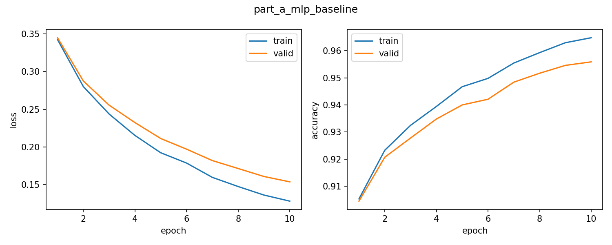
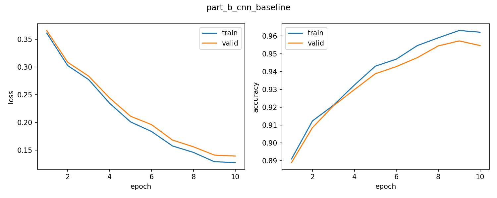
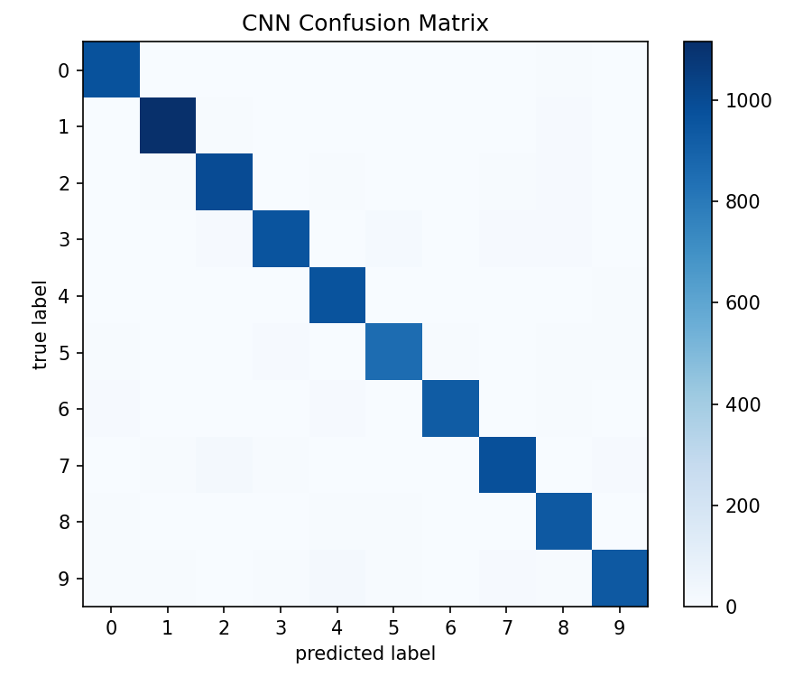
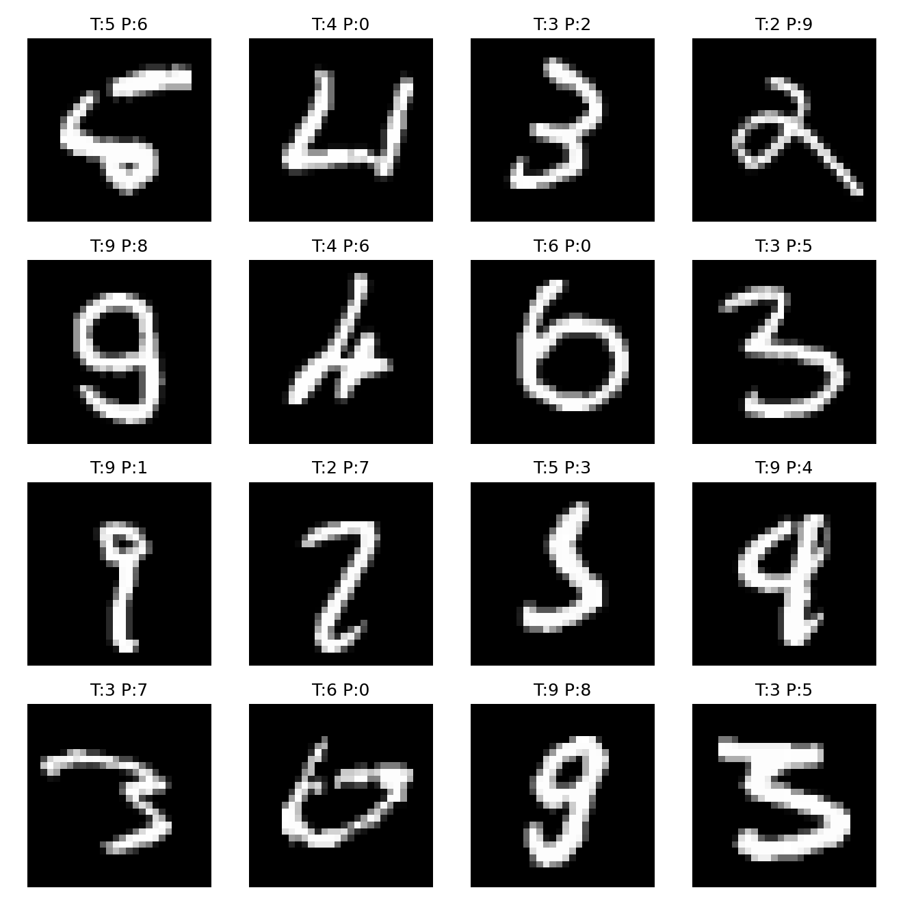
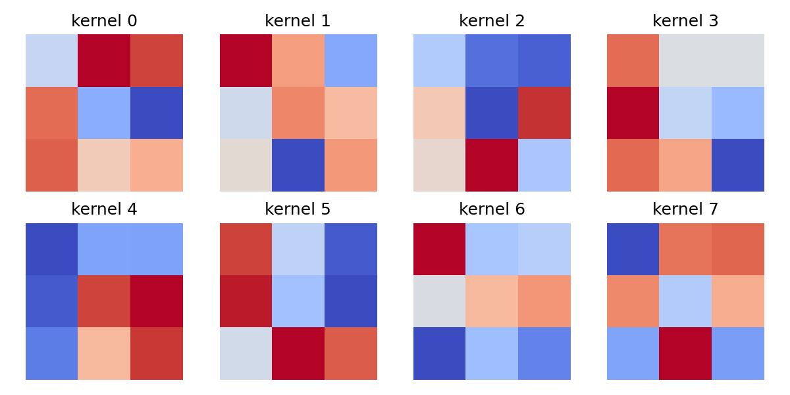
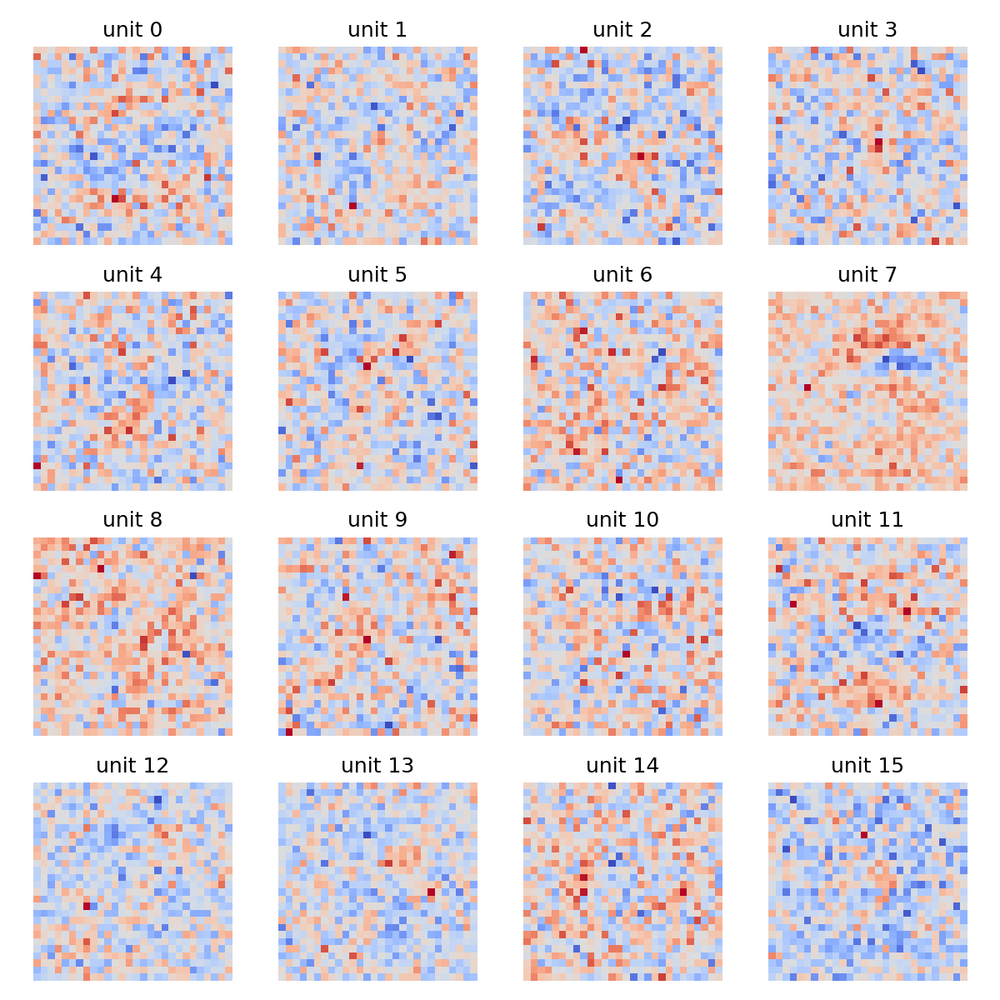

# Project 1 Report: MNIST Neural Network and CNN

姓名：郭行健

学号：23300680008

代码仓库链接：[My-own-AI-playground/deeplearning_practice at main · Gxj230958/My-own-AI-playground](https://github.com/Gxj230958/My-own-AI-playground/tree/main/deeplearning_practice)

模型权重链接：[Gxj230958/deeplearning_practice at main](https://huggingface.co/Gxj230958/deeplearning_practice/tree/main)

> 出于学习的目的，我在完成 Part A 和 Part B 的基础上，把 Part C 的 5 个 directions 都实现了，以便更完整地理解优化、正则化、数据增强、鲁棒性和错误分析之间的关系。

## 1. MLP Baseline

本节对应 Part A。我使用 NumPy 实现了 MLP 所需的核心组件，包括 `Linear.forward`、`Linear.backward` 和带 softmax 的 multi-class cross entropy loss。训练数据为课程提供的 MNIST 数据集，没有使用外部数据。原始图片大小为 `28 x 28`，在 MLP 中被展平成 `784` 维向量。

MLP baseline 的结构为：

```text
Input 784 -> Linear 256 -> ReLU -> Linear 10 -> Softmax Cross Entropy
```

训练设置如下：

- optimizer：SGD
- learning rate：0.06
- batch size：128
- epoch：10
- train/validation split：从 60000 张训练图中划分 10000 张作为 validation set
- test set：MNIST 官方 10000 张测试图

Part A 的主要实验结果：

- 最佳验证准确率：0.9559
- 测试准确率：0.9592
- 测试 loss：0.1397

从学习曲线可以看到，MLP 的训练 loss 和验证 loss 都稳定下降，训练准确率和验证准确率同步上升，没有出现明显的训练集继续提升但验证集明显下降的情况。因此这个 MLP 可以作为后续 CNN 和 Part C 实验的合理 baseline。



## 2. CNN Model and MLP-vs-CNN Comparison

本节对应 Part B。我自己实现了 `conv2D.forward` 和 `conv2D.backward`，并用这些基础算子搭建了一个简单 CNN。CNN 的输入保持为图像形式 `[batch, 1, 28, 28]`，因此它能够利用图像的二维空间结构。

CNN baseline 的结构为：

```text
Input [1, 28, 28]
-> conv2D(1, 8, kernel_size=3, stride=2, padding=1)
-> ReLU
-> conv2D(8, 16, kernel_size=3, stride=2, padding=1)
-> ReLU
-> Flatten
-> Linear(16 * 7 * 7, 10)
-> Softmax Cross Entropy
```

训练设置如下：

- optimizer：SGD
- learning rate：0.03
- batch size：128
- epoch：10
- train/validation/test split 与 MLP baseline 保持一致

CNN baseline 的结果：

- CNN 最佳验证准确率：0.9572
- CNN 测试准确率：0.9639
- CNN 测试 loss：0.1254

与 MLP baseline 相比，CNN 的 test accuracy 从 0.9592 提升到 0.9639，test loss 从 0.1397 降到 0.1254。提升幅度不是特别夸张，但方向是符合预期的：MNIST 是比较简单的数据集，MLP 已经可以达到较高准确率；CNN 的优势主要体现在它保留了图像的局部空间关系，并通过卷积核共享参数学习局部笔画模式。



## 3. Part C: Five Additional Directions

虽然项目只要求选择两个 additional directions，但我希望比较系统地观察每一种方法对训练和泛化的影响。因此我实现了以下全部方向。

### Direction 1: Optimization

本方向实现了两类优化相关改动：

- `part_c1_momentum`：实现并使用 Momentum optimizer。
- `part_c1_multistep_lr`：实现并使用 MultiStepLR 学习率调度。

Momentum 的效果非常明显，MLP baseline 的测试准确率为 0.9592，而 Momentum 实验达到了 0.9780，是本次所有实验中测试准确率最高的结果。相比之下，MultiStepLR 的表现较弱，测试准确率为 0.9283。这个结果说明学习率调度并不是加了就一定好，milestones 和 gamma 的选择会直接影响训练过程。我的设置中学习率下降较早，导致模型后续学习速度变慢。

### Direction 2: Regularization

本方向实现了两类正则化方法：

- `part_c2_l2_regularization`：使用 L2 / weight decay。
- `part_c2_dropout_early_stopping`：实现 Dropout，并加入 early stopping 逻辑。

L2 regularization 的测试准确率为 0.9572，略低于 MLP baseline 的 0.9592；Dropout + early stopping 的测试准确率为 0.9603，略高于 baseline。这个结果说明在当前 MLP 规模和 MNIST 数据集上，过拟合问题不是特别严重，所以正则化带来的提升有限。不过 Dropout 的结果说明它仍然有一定帮助，尤其是让模型不那么依赖某些单独神经元。

### Direction 3: Data Augmentation

本方向在 CNN 训练时加入轻量数据增强，包括：

- 小幅平移
- 小角度旋转

增强后的 CNN 测试准确率达到 0.9725，高于 CNN baseline 的 0.9639，是 CNN 相关实验中最好的结果。这说明对图像任务来说，适当的数据增强非常有效。模型在训练时见过一些轻微变形的数字，因此在测试时面对自然书写差异会更稳健。

### Direction 4: Robustness Analysis

本方向不是改变训练过程，而是测试训练好的模型在扰动数据上的稳定性。扰动包括：

- clean：原始测试集
- translation_shift_2：小幅平移
- rotation_10deg：小角度旋转
- gaussian_noise_sigma_0.2：高斯噪声

这个实验说明准确率高和鲁棒性好并不完全等价。一个模型在 clean test set 上表现很好，不代表它在平移或噪声下仍然稳定。

### Direction 5: Error Analysis and Visualization

本方向生成了：

- CNN confusion matrix
- CNN misclassified examples
- CNN first layer kernels
- MLP first layer weights

这些可视化能看到模型具体在哪些类别上犯错，以及第一层参数大致学到了什么模式。

## 4. Main Results Table

| Experiment | Model | Best Valid Acc | Test Acc | Test Loss |
| --- | --- | --- | --- | --- |
| part_a_mlp_baseline | mlp | 0.9559 | 0.9592 | 0.1397 |
| part_b_cnn_baseline | cnn | 0.9572 | 0.9639 | 0.1254 |
| part_c1_momentum | mlp | 0.9730 | 0.9780 | 0.0715 |
| part_c1_multistep_lr | mlp | 0.9233 | 0.9283 | 0.2612 |
| part_c2_l2_regularization | mlp | 0.9531 | 0.9572 | 0.1445 |
| part_c2_dropout_early_stopping | mlp | 0.9565 | 0.9603 | 0.1332 |
| part_c3_data_augmentation | cnn | 0.9669 | 0.9725 | 0.0927 |

从主结果表可以看到，几个比较重要的现象是：

1. CNN baseline 比 MLP baseline 略好，说明卷积结构确实更适合图像数据。
2. Momentum 对 MLP 的提升最明显，说明优化方法对训练质量影响很大。
3. 数据增强让 CNN 明显超过原始 CNN baseline，说明增强对图像分类任务很有价值。
4. MultiStepLR 表现不如 baseline，说明学习率调度需要谨慎设置，不能机械地认为一定会提升。

## 5. Robustness Results

| Model | Perturbation | Accuracy | Loss |
| --- | --- | --- | --- |
| part_a_mlp_baseline | clean | 0.9592 | 0.1397 |
| part_a_mlp_baseline | translation_shift_2 | 0.7045 | 1.0726 |
| part_a_mlp_baseline | rotation_10deg | 0.9503 | 0.1684 |
| part_a_mlp_baseline | gaussian_noise_sigma_0.2 | 0.9204 | 0.2776 |
| part_b_cnn_baseline | clean | 0.9639 | 0.1254 |
| part_b_cnn_baseline | translation_shift_2 | 0.7910 | 0.7870 |
| part_b_cnn_baseline | rotation_10deg | 0.9553 | 0.1508 |
| part_b_cnn_baseline | gaussian_noise_sigma_0.2 | 0.9214 | 0.2487 |

鲁棒性结果中最明显的是 translation perturbation。MLP 在平移 2 像素后准确率从 0.9592 降到 0.7045，而 CNN 从 0.9639 降到 0.7910。两者都下降明显，但 CNN 下降得少一些。原因是 CNN 的卷积核会在不同位置共享参数，它天然比 MLP 更能处理局部位置变化。不过这个 CNN 没有池化层，也没有特别强的位置不变机制，所以平移仍然会带来较大影响。

rotation_10deg 的影响较小，MLP 和 CNN 分别保持在 0.9503 和 0.9553。Gaussian noise 的影响也存在，但没有平移那么严重，说明模型对轻微像素噪声有一定容忍度。

## 6. Detailed Visualization

### 6.1 Confusion Matrix



混淆矩阵的行表示真实类别，列表示预测类别。对角线表示分类正确，非对角线表示分类错误。当前 CNN 的混淆矩阵整体比较集中在对角线上，说明模型没有出现明显偏向某一类的情况。比较明显的错误包括：

- 真实 `9` 被预测成 `4`：22 次
- 真实 `7` 被预测成 `2`：20 次
- 真实 `3` 被预测成 `5`：17 次
- 真实 `5` 被预测成 `3`：12 次
- 真实 `9` 被预测成 `7`：12 次

这些错误基本符合直觉，因为这些数字在手写体中本来就容易相似。例如有些 `9` 的上半部分和 `4` 比较像，有些 `7` 带弯以后容易接近 `2`，而 `3` 和 `5` 都有上下弯曲结构。

### 6.2 Misclassified Examples



从错误样本可以看到，模型的错误不完全是随机错误。很多样本本身书写就比较模糊，或者笔画连接方式和标准数字差异较大。这说明在 MNIST 上，即使模型已经达到 96% 以上准确率，仍然会遇到人眼也需要停顿一下才能判断的样本。

### 6.3 Weight and Kernel Visualization

权重可视化中的颜色含义如下：

- 偏红：权重是正数
- 偏蓝：权重是负数
- 接近白色/浅色：权重接近 0
- 颜色越深：绝对值越大，说明这个位置对该神经元或卷积核影响越强

CNN 第一层卷积核如下：



这些卷积核可以理解为模型在第一层学习到的局部笔画检测器。不同卷积核对不同方向、不同局部形状的笔画有不同响应。

MLP 第一层权重如下：



MLP 的第一层权重被 reshape 成 `28 x 28` 后，可以大致观察每个隐藏神经元更关注哪些图像区域。和 CNN 卷积核相比，MLP 权重是直接连接到整张图的每个像素，因此它缺少 CNN 那种局部共享的结构约束。

### 6.4 Debugging Note: CNN Initialization and Speed

在第一次实现 CNN 时，我直接使用了标准正态分布初始化卷积层、全连接层和 bias，标准差接近 1.0。实验结果非常差，模型几乎没有学习：

```text
[part_b_cnn_baseline] epoch 1/5 train_acc=0.0980 valid_acc=0.0950 train_loss=2.4094 valid_loss=2.4224
[part_b_cnn_baseline] epoch 2/5 train_acc=0.0980 valid_acc=0.0948 train_loss=2.4113 valid_loss=2.4198
[part_b_cnn_baseline] epoch 3/5 train_acc=0.1002 valid_acc=0.0976 train_loss=2.3130 valid_loss=2.3147
[part_b_cnn_baseline] epoch 4/5 train_acc=0.1002 valid_acc=0.0996 train_loss=2.3236 valid_loss=2.3241
[part_b_cnn_baseline] epoch 5/5 train_acc=0.1054 valid_acc=0.1041 train_loss=2.3084 valid_loss=2.3120
```

进一步检查后发现，前 1000 个测试样本中有 972 个被预测为数字 `7`。这说明模型输出被随机初始化造成的偏置严重影响，几乎退化成了固定类别预测。后来我改用 He/Kaiming initialization 初始化权重，并将 bias 初始化为 0，CNN 才开始正常训练。

另外，最初的 `conv2D` 使用了多重 Python for 循环，5 个 epoch 运行了约 5.5 小时，速度不可接受。后来我改为使用 `np.lib.stride_tricks.sliding_window_view` 取出所有卷积窗口，并用 `np.einsum` 做批量乘加。这样仍然是 NumPy 手写卷积，没有调用深度学习框架，但 full setting 下 CNN 一个 epoch 约 35 秒，实验效率大幅提升。

## 7. Discussion

### 7.1 CNN 处理图像分类任务是否比 MLP 更好？

从我的实验结果看，CNN 确实比 MLP 更适合 MNIST 这类图像分类任务。MLP baseline 的 test accuracy 是 0.9592，而 CNN baseline 是 0.9639，虽然提升不是特别大，但 CNN 的 test loss 也更低，从 0.1397 降到 0.1254。这个结果说明 CNN 不只是多猜对了一些样本，它整体的预测置信度也更合理。

我认为提升幅度不大的原因是 MNIST 本身比较简单，数字都居中、背景干净，MLP 只要参数量足够，也能学到不错的分类边界。但是 CNN 的结构更符合图像数据：卷积核会关注局部笔画，同一个卷积核在整张图上共享参数，因此它不需要为每个像素位置单独学习一套模式。这个 inductive bias 对图像任务是有帮助的。

### 7.2 Momentum 或学习率调度是否让训练更稳定或更快？

Momentum 的效果最明显。MLP baseline 的 test accuracy 是 0.9592，而 Momentum 实验达到了 0.9780。这说明在当前设置下，Momentum 帮助模型更快、更充分地沿着稳定方向下降。普通 SGD 每次只看当前 batch 的梯度，更新方向会有一定抖动；Momentum 会积累历史方向，减少一些来回震荡。

但是 MultiStepLR 的结果反而不理想，test accuracy 只有 0.9283。我认为这可能不是学习率调度本身不好，而是我这组 milestones 设置得不够合适。学习率在比较早的时候下降，导致模型后面更新幅度变小，还没有充分学习就进入了较慢阶段。所以优化技巧中的具体超参数非常重要。

### 7.3 L2、Dropout、early stopping 是否改善验证集表现？

L2 regularization 的表现略低于 baseline，test accuracy 为 0.9572；Dropout + early stopping 略高于 baseline，test accuracy 为 0.9603。这个结果说明在当前 MLP 规模下，baseline 其实没有特别严重的过拟合，所以正则化带来的收益比较有限。

从训练曲线看，baseline 的 train accuracy 和 validation accuracy 差距并不大，因此强行加入 L2 不一定提升表现，反而可能稍微限制模型拟合能力。Dropout 的结果略好一些，我理解是因为它让隐藏层神经元不能过分依赖某几个特征，从而带来一点泛化提升。Early stopping 在这次 10 epoch 内没有特别戏剧性的作用，但它作为防止训练过久导致过拟合的保险机制仍然是有意义的。

### 7.4 数据增强是否提升了干净测试集或扰动测试集上的表现？

数据增强是 CNN 相关实验中最有效的改动。CNN baseline 的 test accuracy 是 0.9639，加入轻量平移和旋转增强后，test accuracy 提升到 0.9725，test loss 也从 0.1254 降到 0.0927。

这个结果很符合直觉。手写数字本身就存在位置和角度的小变化，如果训练时只看原始图像，模型可能对某些固定位置和笔画方向比较敏感。加入轻量增强后，模型会在训练中看到同一个数字的多个轻微变形版本，因此学到的特征更稳定。这里我也注意到增强不能过强：如果旋转和平移太大，反而会让训练早期变困难。所以我最后使用的是比较温和的增强（平移 1 像素，旋转 5 度），避免增强太强导致模型前期学不动。

### 7.5 哪些数字最容易混淆？

从 CNN 的混淆矩阵看，最明显的混淆包括 `9 -> 4`、`7 -> 2`、`3 -> 5`、`5 -> 3` 和 `9 -> 7`。其中真实 `9` 被预测成 `4` 有 22 次，是比较突出的错误；真实 `7` 被预测成 `2` 有 20 次；真实 `3` 被预测成 `5` 有 17 次。

这些错误并不奇怪，因为它们和手写数字的形状有关。例如有些 `9` 的上半部分如果写得开口或者竖线较明显，就容易像 `4`；有些 `7` 如果带弯，看起来会接近 `2`；而 `3` 和 `5` 都有上下两个弯曲结构，如果中间连接方式模糊，就容易互相误判。

我觉得这个部分很有意思，因为这说明不能只看总 accuracy。总准确率达到 96% 以上时，模型整体已经不错，但错误仍然集中在某些形状相近的类别上。后续如果想进一步提升，可以考虑更强的数据增强、更深的 CNN、加入 pooling，或者专门分析这些易混淆类别的样本。

## 8. Conclusion

本项目从零实现了 MLP、softmax cross entropy、CNN 卷积层、Momentum、学习率调度、Dropout、L2 regularization、数据增强、鲁棒性测试和错误分析。实验结果表明：

1. MLP 可以作为 MNIST 的有效 baseline，测试准确率达到 0.9592。
2. CNN 更适合图像分类，baseline 测试准确率达到 0.9639。
3. Momentum 显著改善 MLP 优化效果，测试准确率达到 0.9780。
4. 数据增强显著提升 CNN 表现，测试准确率达到 0.9725。
5. 鲁棒性分析显示，平移扰动对模型影响最大，CNN 比 MLP 更稳定但仍会下降。
6. 错误分析显示，主要错误集中在形状相似的数字之间。

通过这次项目，我完整实现了实现基础算子 -> 训练模型 -> 发现异常结果 -> 排查初始化和效率问题 -> 改进实现 -> 重新实验 -> 分析错误样本的过程。这让我对神经网络训练中的 forward、backward、初始化、优化器和实验比较有了更具体的理解。
