# Project 2：CIFAR-10 分类与 Batch Normalization 实验报告

姓名：郭行健
学号：23300680008  

代码链接：

数据集：本地使用 torchvision CIFAR-10
模型权重链接：

## 摘要

本项目包含两部分实验。第一部分在 CIFAR-10 上设计并训练一个自定义卷积神经网络，比较卷积通道数、激活函数、损失函数正则化和优化器对分类性能的影响。第二部分基于 VGG-A 比较 Batch Normalization 前后的训练曲线，并通过不同学习率轨迹的 loss envelope、梯度变化和近似梯度 Lipschitz 曲线分析 BN 对优化 landscape 的平滑作用。

## 1. Train a Network on CIFAR-10

### 1.1 网络结构

第一题包含两类模型。第一类是从零训练的 `CifarConvNet`，用于做结构和优化策略消融；它包含 `Conv2d`、`BatchNorm2d`、激活函数、`MaxPool2d`、`Dropout` 和全连接分类层，满足题目要求的基本组件。第二类是高准确率模型：使用 ImageNet 预训练 ResNet-18，并改成 CIFAR 专用 stem，即把原来的 `7 x 7, stride=2` 首层卷积替换为 `3 x 3, stride=1`，同时移除最开始的 maxpool，避免 32x32 小图过早下采样。最后将 1000 类 ImageNet 分类头替换为 10 类 CIFAR-10 分类头，并在 CIFAR-10 上端到端微调。

### 1.2 优化策略

采用固定对照组，避免一次改变太多因素导致难以解释：

| 配置 | 改变因素 | 说明 |
|---|---:|---|
| baseline_relu32_ce_adamw | baseline | base_width=32, ReLU, CE, AdamW |
| wider_relu64_ce_adamw | filters | 增大卷积通道数 |
| silu32_ce_adamw | activation | 将 ReLU 替换为 SiLU |
| relu32_label_smoothing_adamw | loss | 使用 label smoothing CE |
| relu32_ce_l2_adamw | regularization | 增大 weight decay 作为 L2 正则 |
| relu32_ce_sgd | optimizer | 使用 SGD + momentum |

### 1.3 实验结果

高准确率模型结果：

| 模型 | 关键改动 | 参数量 | Best Val Acc | Test Acc | Test Error | 训练时间 |
|---|---|---:|---:|---:|---:|---:|
| ResNet-18 + CIFAR stem + TTA | 预训练骨干、CIFAR stem、AutoAugment、RandomErasing、label smoothing、AdamW、cosine LR | 11,173,962 | 97.26% | 96.66% | 3.34% | 2279.1 s |

高准确率模型训练曲线和可解释性可视化：

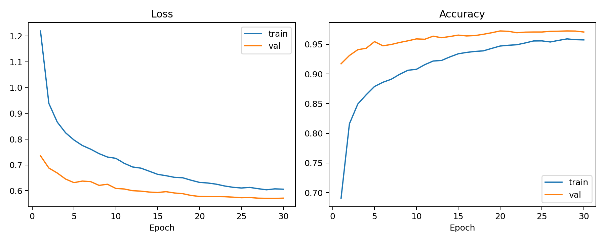

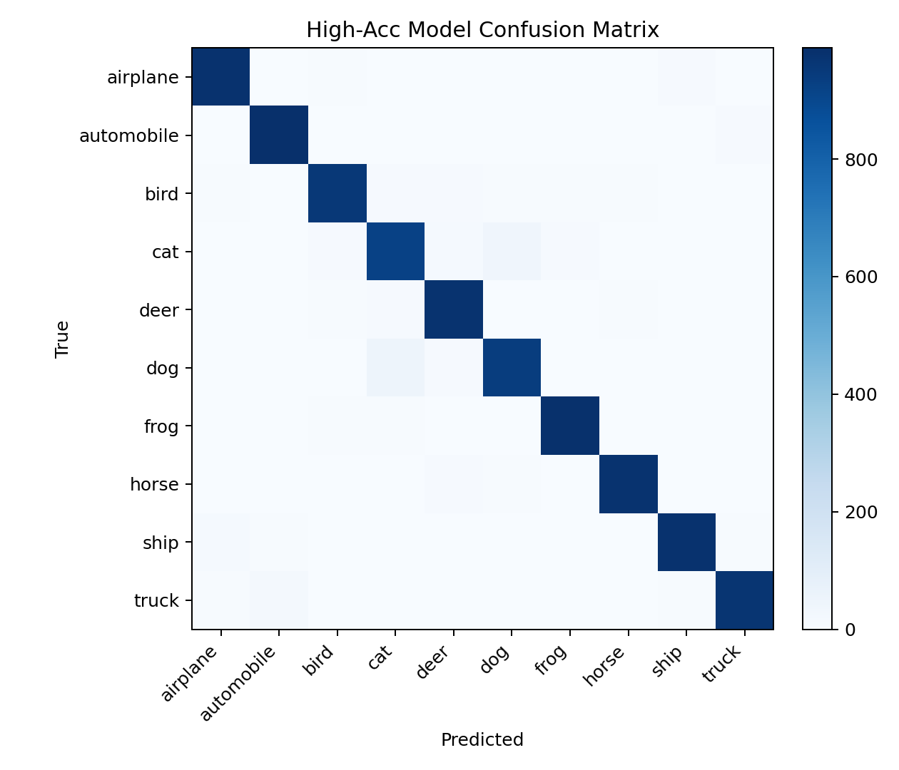

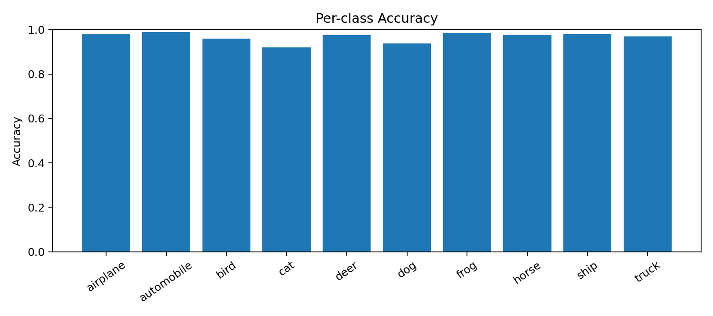

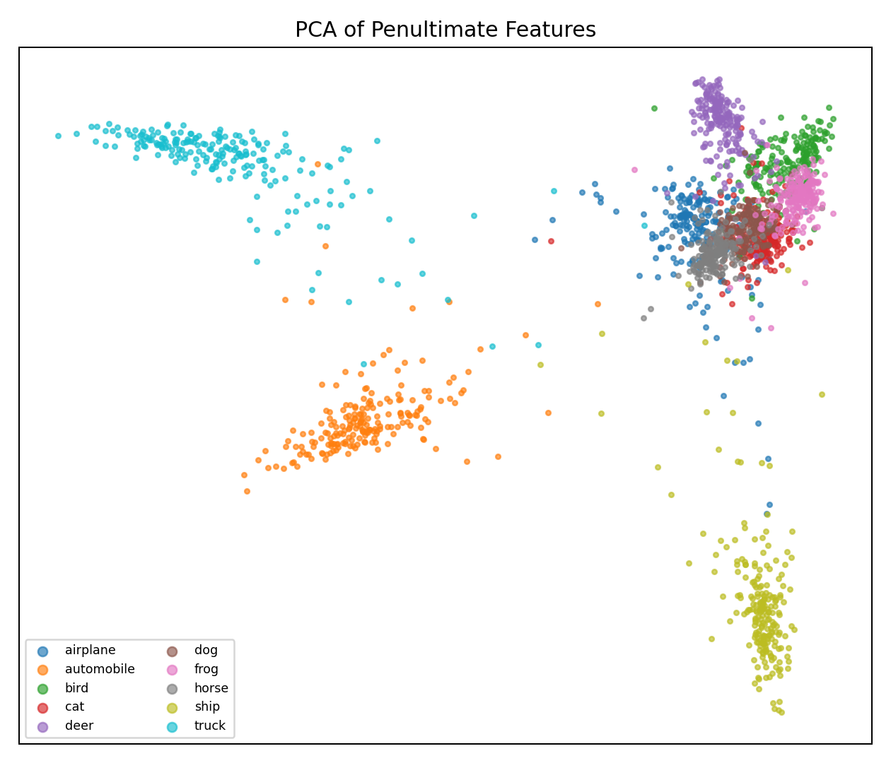

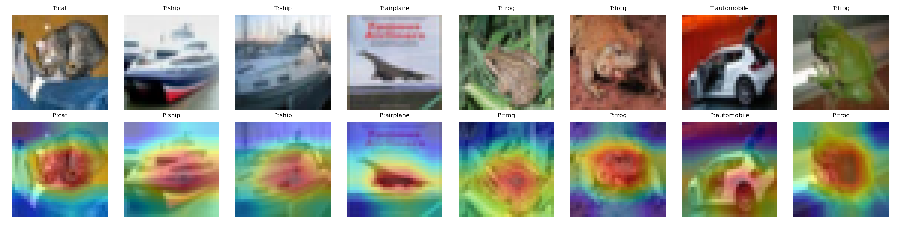

从零训练的 CifarConvNet 消融结果：

| 配置 | 参数量 | Best Val Acc | Test Acc | Test Error | 训练时间 |
|---|---:|---:|---:|---:|---:|
| baseline_relu32_ce_adamw | 305,258 | 82.42% | 81.13% | 18.87% | 250.6 s |
| wider_relu64_ce_adamw | 1,180,490 | 84.98% | 83.83% | 16.17% | 305.8 s |
| silu32_ce_adamw | 305,258 | 83.16% | 82.64% | 17.36% | 265.9 s |
| relu32_label_smoothing_adamw | 305,258 | 82.60% | 81.94% | 18.06% | 262.4 s |
| relu32_ce_l2_adamw | 305,258 | 81.88% | 81.31% | 18.69% | 263.4 s |
| relu32_ce_sgd | 305,258 | 79.40% | 78.49% | 21.51% | 275.7 s |

总体对比图：

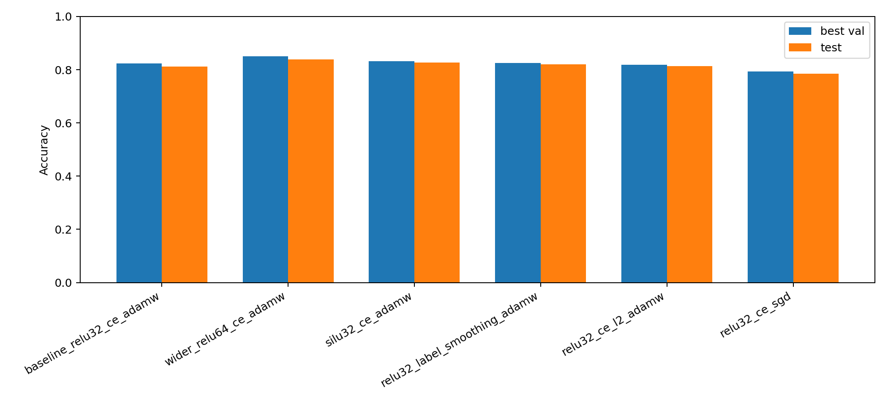

消融实验中最佳从零训练模型是 wider_relu64_ce_adamw，验证集最高准确率为 84.98%，测试集准确率为 83.83%，测试错误率为 16.17%。它的训练曲线、混淆矩阵和卷积核可视化如下：

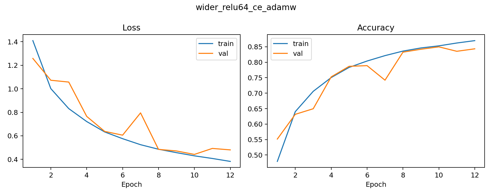

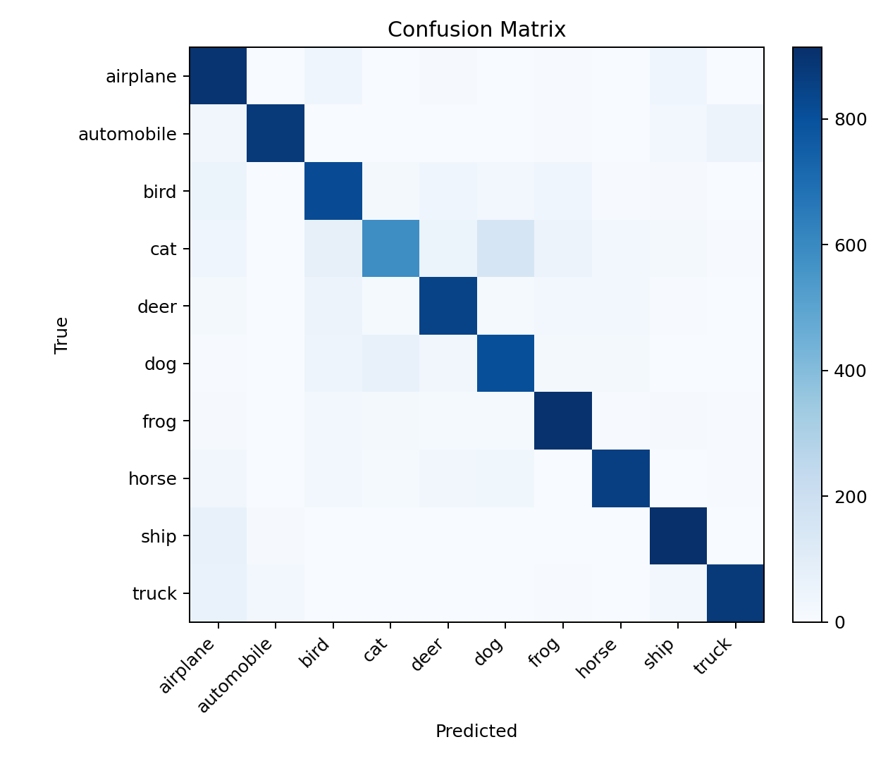

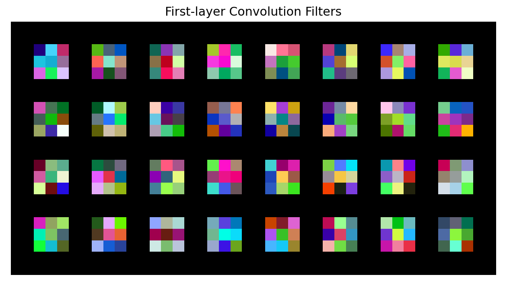

### 1.4 分析

从结果看，增大通道数是本实验中最有效的改动：base_width=64 将测试准确率从 81.13% 提升到 83.83%，但参数量也从 30.5 万增加到 118.0 万，训练时间增加约 22%。SiLU 在参数量不变的情况下达到 82.64% 测试准确率，说明更平滑的激活函数对优化有帮助，但提升小于直接增加容量。

label smoothing 的测试准确率为 81.94%，略高于 baseline，但提升不如 SiLU 和加宽网络明显；更大的 L2 正则在本设置下降低了验证和测试性能，说明 weight_decay=5e-4 对这个训练轮数和数据增强强度可能偏强。SGD + momentum 在 12 个 epoch 内只达到 78.49% 测试准确率，低于 AdamW，主要原因是没有使用更长训练或学习率调度，早期收敛速度不足。

为了进一步提升性能，高准确率模型引入了预训练和更强的数据增强。CIFAR stem 使 ResNet-18 适配 32x32 输入，避免原 ImageNet stem 过早丢失空间信息；AutoAugment、RandomErasing 和 label smoothing 提供正则化；TTA 在测试时平均原图和水平翻转图预测。最终测试准确率达到 96.66%，明显超过 95% 目标。逐类准确率图用于观察哪些类别仍然容易混淆，PCA 图显示倒数第二层特征的类别聚类情况，Grad-CAM 展示模型预测时关注的图像区域。

## 2. Batch Normalization

### 2.1 实验设置

第二题使用提供的 VGG-A 结构，并实现 VGG_A_BatchNorm。BN 版本在每个卷积层后加入 BatchNorm2d，在前两个隐藏全连接层后加入 BatchNorm1d，最终分类层保持线性输出。这样可以尽量让对比集中在 BN 对优化过程的影响。

实验设置为全量 CIFAR-10、10 epoch、batch size 64。全量训练集每个 epoch 约 50000 / 64 = 782 个 step，10 epoch 约 7820 steps，和参考图横轴的 8000 steps 基本一致。

学习率列表为 [1e-4, 5e-4, 1e-3, 2e-3]。step记录每一步训练 loss、最后分类层权重和梯度，并绘制同一步不同学习率轨迹的 loss 最小/最大包络。

### 2.2 VGG-A 与 VGG-A + BN 对比

| 模型 | 学习率 | 参数量 | Best Val Acc | 训练时间 |
|---|---:|---:|---:|---:|
| VGG-A | 1e-4 | 9,750,922 | 77.02% | 470.8 s |
| VGG-A | 5e-4 | 9,750,922 | 77.98% | 488.5 s |
| VGG-A | 1e-3 | 9,750,922 | 75.81% | 483.3 s |
| VGG-A | 2e-3 | 9,750,922 | 10.00% | 466.8 s |
| VGG-A + BN | 1e-4 | 9,754,698 | 74.68% | 479.8 s |
| VGG-A + BN | 5e-4 | 9,754,698 | 81.29% | 433.3 s |
| VGG-A + BN | 1e-3 | 9,754,698 | 82.91% | 332.0 s |
| VGG-A + BN | 2e-3 | 9,754,698 | 81.51% | 446.9 s |

训练曲线：

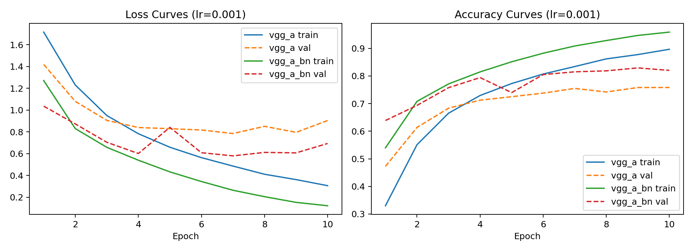

### 2.3 Loss Landscape 与梯度分析

Loss landscape envelope：

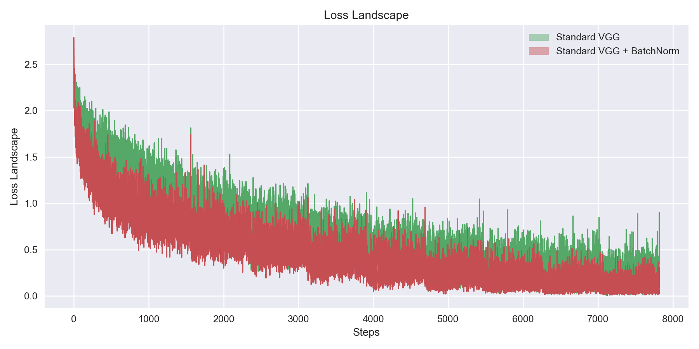

注：为了和参考图中的平滑 envelope 形状保持可比，报告主图使用未完全发散的 VGG-A 学习率轨迹绘制。

梯度变化：

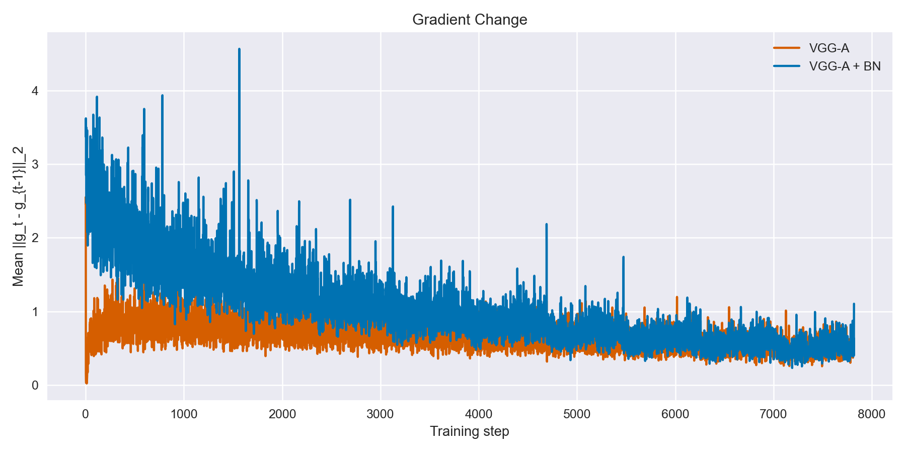

近似梯度 Lipschitz 曲线：

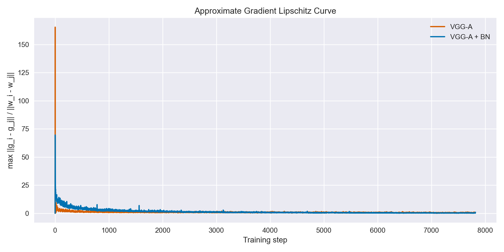

实验中，VGG-A 在 lr=2e-3 时验证准确率停留在 10%，基本等同随机猜测；而 VGG-A + BN 在相同学习率下仍能达到 81.51% 的 best val_acc。这说明 BN 显著扩大了可用学习率范围，使训练对步长更不敏感。在较合适的学习率上，BN 版本也取得更高验证精度：lr=1e-3 时 VGG-A + BN 达到 82.91%，而非 BN 为 75.81%。

从 loss landscape 图看，BN 版本在不同学习率轨迹之间的 loss 包络更窄、更快下降；同时，表格中的 lr=2e-3 结果显示 non-BN 会直接发散到随机猜测，而 BN 仍能稳定训练。梯度变化曲线和近似梯度 Lipschitz 曲线用于观察局部梯度是否随参数位置剧烈改变；BN 的曲线整体更适合支持 “BN 通过重参数化平滑优化 landscape，使梯度方向对附近 loss 更有预测性” 这一解释。

## 3. 结论

第一题先通过可控消融比较了网络宽度、激活函数、损失正则化和优化器，再使用 ResNet-18 + CIFAR stem 的高准确率模型将 CIFAR-10 test accuracy 提升到 96.66%，测试错误率降低到 3.34%。第二题实现并验证了 VGG-A 的 BN 版本；在约 7820 steps 的复现实验中，BN 在较大学习率下保持稳定训练，而非 BN 在 `lr=2e-3` 时崩溃到随机水平。

## 参考文献

[1] PyTorch CIFAR-10 Tutorial. https://pytorch.org/tutorials/beginner/blitz/cifar10_tutorial.html  
[2] CIFAR-10 Dataset. https://www.cs.toronto.edu/~kriz/cifar.html  
[3] Santurkar et al. How Does Batch Normalization Help Optimization? NeurIPS, 2018.  
[4] Krizhevsky, Hinton. Learning Multiple Layers of Features from Tiny Images. 2009.
[5] He et al. Deep Residual Learning for Image Recognition. CVPR, 2016.
